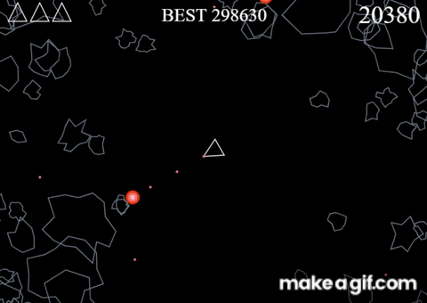

# asteroids

The 1979 Atari arcade space shooter game Asteroids, recreated in Javascript. 

Additionally, there is a neural network built without using any frameworks that can be trained to play. 

## Overview

In order to manually play, run asteroids.html in your browser and make sure to turn the `AUTOMATION_ON` constant to `false`.
Use the left and right arrow keys to rotate the ship. Use the up arrow key to move forward, and hit spacebar to shoot.

To train a neural network to play, turn `AUTOMATION_ON` to `true`. You can change `NUM_SAMPLES` to vary training iterations and `OUTPUT_THRESHHOLD` to change the necessary accuracy in order for the spaceship to commit to a turn.

### Automated player with 1,000,000 training iterations

 

## Acknowledgements

Built following a [tutorial](https://www.youtube.com/watch?v=H9CSWMxJx84&list=PLWKjhJtqVAbmqFs83T4W-FZQ9kK983tZC&index=9) on freeCodeCamp
